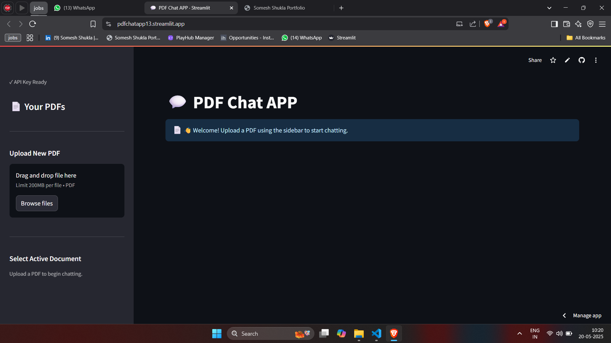
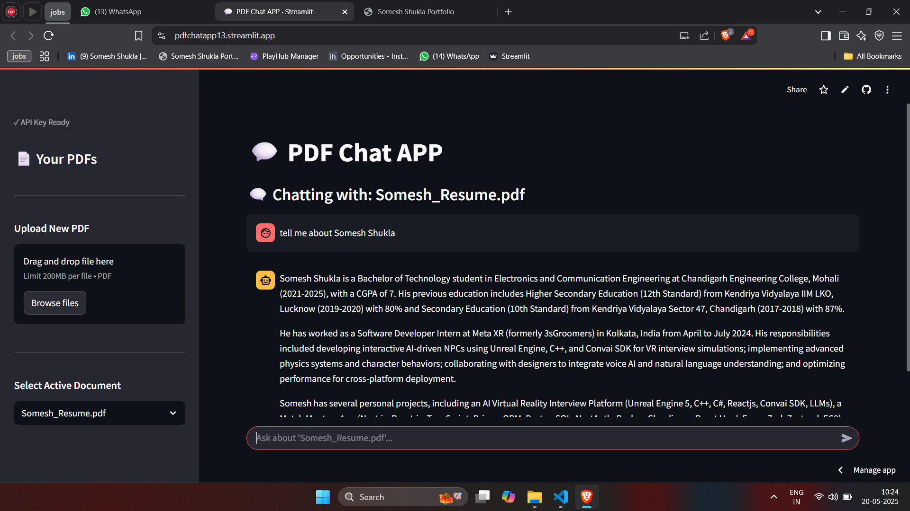

# 💬 PDF Chat App - Talk to Your Documents!

** Try it out live! [PDF Chat App on Streamlit Cloud](https://pdfchatapp13.streamlit.app/) **

Hey there! This is a simple web application that lets you upload PDF files and then ask questions about their content. Think of it like having a conversation directly with your documents!

## 🚀 How It Works (The Gist)

1.  **Upload:** You pick a PDF file.
2.  **Process:** The app reads the text from your PDF.
3.  **Embed & Store:** It then breaks this text into smaller pieces and uses a Google AI model to turn these pieces into embeddings. These embeddings are stored in a local FAISS vector store, which is like a super-efficient index for your PDF's content. This happens once per PDF.
4.  **Ask:** You type in a question.
5.  **Search & Answer:** The app searches the vector store for the most relevant text chunks from your PDF related to your question. These chunks, along with your question, are then sent to the Gemini chat model, which generates an answer.

## 🛠️ Tech Stack

*   Python 3.x
*   Streamlit (for the web UI)
*   Google Generative AI SDK (for Gemini models)
*   Langchain (to help manage interactions with the AI models)
*   FAISS (for creating and searching vector stores)
*   PyPDF2 (for extracting text from PDFs)
*   Python-dotenv (for managing API keys)

